## Part-A

#### 1. Characteristics of IoT

- **Connectivity** - Things are connected to the internet and to each other.
- **Intelligence** - IoT systems have embedded intelligence for decision making.
- **Scalability** - Can scale to accommodate more devices without redesign.
- **Dynamic Nature** - Devices can join or leave the network dynamically.
- **Heterogeneity** - Supports diverse hardware, OS, and networks.
- **Safety & Security** - Data integrity and device security are built in.
- **Self-Configuring** - Devices configure themselves upon joining the network.

---

#### 2. IoT systems are self-adapting and self-configuring. Justify your answer.

**Self-Configuring:** When a new IoT device (e.g., a smart bulb) is added to a network, it automatically discovers the network, authenticates, and downloads required firmware - without manual setup.

**Self-Adapting:** IoT systems adjust their behavior based on changing environmental conditions. For example, a smart HVAC system senses rising temperature and automatically increases cooling without human intervention.

These properties make IoT systems autonomous and scalable for large deployments.

---

#### 3. Real-time examples of IoT systems (6 examples)

1. Smart Home (Alexa controlling lights and thermostat)
2. Wearable Health Monitors (Fitbit tracking heart rate)
3. Smart Agriculture (soil moisture sensors automating irrigation)
4. Connected Vehicles (GPS and engine diagnostics)
5. Industrial Automation (factory floor sensors monitoring machines)
6. Smart Grid (electricity meters reporting real-time usage)

---

#### 4. Role of controller service in IoT system

The **Controller Service** acts as the central coordinator between IoT devices and the cloud/application layer. It:

- Receives data from sensing devices.
- Processes and routes data to appropriate services or cloud platforms.
- Sends control commands back to actuators.
- Manages device authentication and session handling.

Example: In a smart home, the controller service receives sensor data and triggers the actuator (fan/AC) based on defined rules.

---

#### 5. Various output elements in IoT

Output elements (actuators) convert electrical signals from the controller into physical action:

|Output Element|Example|Action|
|---|---|---|
|LED / Display|Smart signage|Visual output|
|Motor (DC/Servo)|Robot arm|Mechanical movement|
|Relay|Smart switch|On/Off control|
|Speaker / Buzzer|Alarm system|Audio alert|
|Solenoid Valve|Smart irrigation|Fluid control|

---

#### 6. Compare IoT, IoE & M2M

|Feature|IoT|IoE|M2M|
|---|---|---|---|
|Full Form|Internet of Things|Internet of Everything|Machine to Machine|
|Scope|Devices connected to internet|People, processes, data + devices|Two machines communicating directly|
|Human Involvement|Minimal|High (includes people)|None|
|Intelligence|Moderate|High (AI/analytics driven)|Low|
|Network Required|Internet|Internet + enterprise network|Any network (cellular, LAN)|
|Example|Smart bulb|Smart city ecosystem|Vending machine reporting stock|

---

#### 7. Wearable sensors in medical applications

1. **ECG sensor** - monitors heart electrical activity
2. **SpO2 sensor** - measures blood oxygen saturation
3. **Accelerometer** - tracks body movement and fall detection
4. **Glucose sensor** - continuous blood sugar monitoring
5. **Temperature sensor** - body temperature tracking
6. **EMG sensor** - measures muscle electrical signals

---

#### 8. Way of representing inputs in Arduino programming

Inputs in Arduino are represented using `digitalRead()` for digital signals and `analogRead()` for analog signals.

```ino
// Digital input - returns HIGH or LOW
int val = digitalRead(pinNumber);

// Analog input - returns 0 to 1023
int val = analogRead(A0);
```

Pin mode must be declared in `setup()`:

```ino
pinMode(2, INPUT);        // Digital input
pinMode(2, INPUT_PULLUP); // Digital input with internal pull-up
```

---

#### 9. Program to display "IoT" serially in serial monitor

```ino
void setup() {
  Serial.begin(9600);
}

void loop() {
  Serial.println("IoT");
  delay(1000);
}
```

---

#### 10. Define IoT with an example

**IoT (Internet of Things)** is a network of physical objects embedded with sensors, software, and connectivity to collect and exchange data over the internet - enabling remote monitoring and control without human intervention.

**Example:** A smart refrigerator monitors its contents using sensors, tracks expiry dates, and automatically places online grocery orders when stock is low.

---

#### 11. Brief SPI and I2C in physical design of IoT

**SPI (Serial Peripheral Interface):**

- 4-wire protocol: MOSI, MISO, SCK, SS
- Full duplex, high speed (up to 10 Mbps)
- Master-slave architecture, one master, multiple slaves
- Used for: SD cards, TFT displays, RF modules

**I2C (Inter-Integrated Circuit):**

- 2-wire protocol: SDA (data), SCL (clock)
- Supports multiple masters and slaves on same bus
- Each device has a unique 7-bit address
- Slower than SPI (~400 kbps), suitable for short distances
- Used for: OLED displays, BME280 sensor, EEPROM

---

#### 12. Short notes on URI

**URI (Uniform Resource Identifier)** is a string of characters that uniquely identifies a resource on the internet or a network.

**Syntax:** `scheme://authority/path?query#fragment`

**Example:** `http://api.iot-device.com/sensor/temperature?unit=celsius`

- URI is used in IoT REST APIs to identify device endpoints.
- Two types: **URL** (locates a resource) and **URN** (names a resource).
- CoAP protocol (used in IoT) uses URI to address sensor data resources.

---

#### 13. Main components of Arduino UNO board

1. **ATmega328P Microcontroller** - the processing core
2. **Digital I/O Pins (14)** - pins 0-13, can be input or output
3. **Analog Input Pins (6)** - A0 to A5, 10-bit ADC
4. **Power Pins** - 3.3V, 5V, GND, VIN
5. **USB Interface (ATmega16U2)** - for programming and serial communication
6. **Crystal Oscillator (16 MHz)** - clock source
7. **Reset Button** - restarts the sketch
8. **ICSP Header** - for in-circuit serial programming
9. **DC Power Jack** - external 7-12V power input
10. **TX/RX LEDs** - serial communication indicators

---

#### 14. Need for API and its types

**Need for API:** API (Application Programming Interface) allows different software systems to communicate with each other in a standardized way. In IoT, APIs enable apps, cloud platforms, and devices to exchange data without knowing internal implementations.

**Types:**

1. **REST API** - uses HTTP methods (GET, POST, PUT, DELETE), most common in IoT
2. **SOAP API** - XML-based, used in enterprise systems
3. **GraphQL API** - client specifies exact data needed
4. **WebSocket API** - real-time bidirectional communication

---

#### 15. Simple program using LED & push button to demonstrate digital IO

```ino
const int ledPin = 13;
const int buttonPin = 2;

void setup() {
  pinMode(ledPin, OUTPUT);
  pinMode(buttonPin, INPUT);
}

void loop() {
  int buttonState = digitalRead(buttonPin);
  if (buttonState == HIGH) {
    digitalWrite(ledPin, HIGH); // LED ON when button pressed
  } else {
    digitalWrite(ledPin, LOW);  // LED OFF when released
  }
}
```

---

#### 16. Condition and looping statements in Arduino

**Conditional Statements:**

```ino
if (condition) { }
else if (condition) { }
else { }
switch (variable) { case x: break; }
```

**Looping Statements:**

```ino
for (int i = 0; i < 10; i++) { }
while (condition) { }
do { } while (condition);
```

---

---

## Part-B

#### 1. Logic design of IoT

The **Logic Design of IoT** defines the functional architecture of an IoT system, describing how data flows from physical devices through processing layers to applications.

##### Layers in IoT Logic Design

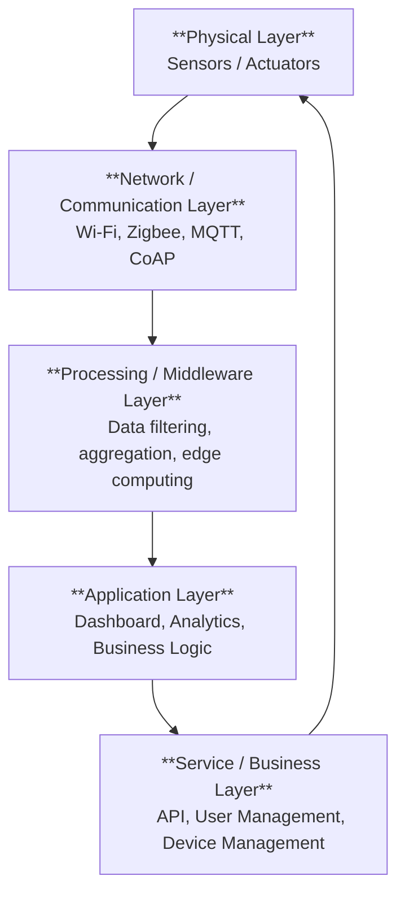

##### Layer-wise Explanation

**1. Physical Layer (Perception Layer)**

- Comprises sensors (temperature, humidity, motion) and actuators (motors, relays).
- Collects raw data from the physical environment.
- Example: DHT11 sensor reading temperature and humidity.

**2. Network / Communication Layer**

- Responsible for transmitting sensor data to processing units.
- Uses protocols: MQTT, CoAP, HTTP, Zigbee, Z-Wave, Wi-Fi, Bluetooth.
- Includes gateways that bridge different network types.

**3. Processing / Middleware Layer**

- Filters, processes, and aggregates raw data.
- Performs edge computing to reduce latency and cloud bandwidth.
- Includes databases and message brokers (e.g., Mosquitto, RabbitMQ).

**4. Application Layer**

- Delivers processed information to end users.
- Includes dashboards, mobile apps, alert systems.
- Example: ThingSpeak dashboard showing sensor graphs.

**5. Service / Business Layer**

- Manages overall system: user authentication, device registration, APIs.
- Enables third-party integration via REST APIs.
- Provides business intelligence using the processed IoT data.

##### Data Flow Summary

|Stage|Action|Example|
|---|---|---|
|Sensing|Raw data collection|Temp = 37°C|
|Transmission|Data sent via protocol|MQTT publish to broker|
|Processing|Filtering and analysis|Detect fever condition|
|Action|Trigger actuator/alert|Send SMS alert|
|Feedback|Update application|Dashboard updated|

---

#### 2. IoT levels with examples for real world applications (16 marks)

IoT systems are categorized into **6 levels** based on complexity, number of nodes, data flow, and the degree of cloud involvement.

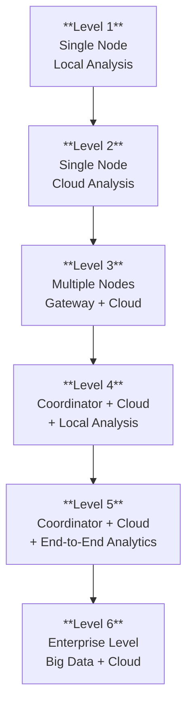

---

##### Level 1 - Single Node, Minimal Network

- One device with sensing and actuation.
- Data analyzed locally on the device itself.
- No cloud or internet required.
- Suitable for simple, standalone control systems.

**Architecture:** `Sensor -> Microcontroller -> Actuator`

**Example:** Automatic night lamp - LDR sensor triggers LED via Arduino with no internet.

|Feature|Detail|
|---|---|
|Nodes|1|
|Cloud|No|
|Analysis|On-device|
|Connectivity|None|

---

##### Level 2 - Single Node with Cloud Analysis

- Single device connected to the internet.
- Raw data sent to cloud for storage and analysis.
- Cloud sends control commands back to actuator.

**Architecture:** `Sensor -> Microcontroller -> Internet -> Cloud -> Actuator`

**Example:** Smart energy meter - reads power consumption and pushes data to cloud dashboard. User views analytics via mobile app.

|Feature|Detail|
|---|---|
|Nodes|1|
|Cloud|Yes|
|Analysis|Cloud|
|Connectivity|Wi-Fi / Ethernet|

---

##### Level 3 - Multiple Nodes with Local Processing

- Multiple sensing nodes, each with local processing.
- Data pre-processed at node level before being sent to cloud.
- Reduces cloud load and latency.

**Architecture:** `Multiple Sensors -> Microcontrollers (local processing) -> Gateway -> Cloud`

**Example:** Smart home system - multiple sensors (temperature, door, motion) each pre-process data and send summaries to cloud.

|Feature|Detail|
|---|---|
|Nodes|Multiple|
|Cloud|Yes|
|Analysis|Local + Cloud|
|Connectivity|Wi-Fi / Zigbee|

---

##### Level 4 - Coordinator Node + Cloud

- A coordinator node (gateway/hub) collects data from multiple sensor nodes.
- Coordinator performs aggregation and sends to cloud.
- Cloud sends control decisions back.

**Architecture:** `Sensor Nodes -> Coordinator -> Internet -> Cloud`

**Example:** Smart agriculture - soil sensors and weather stations send data to a local gateway, which aggregates and uploads to cloud. Cloud triggers irrigation valves.

|Feature|Detail|
|---|---|
|Nodes|Many + Coordinator|
|Cloud|Yes|
|Analysis|Coordinator + Cloud|
|Connectivity|Zigbee / LoRa + Internet|

---

##### Level 5 - Coordinator + Cloud + End-to-End Analytics

- Full analytics pipeline from edge to cloud.
- Edge analytics run at coordinator; advanced ML/AI in cloud.
- Bidirectional data flow with real-time feedback.

**Architecture:** `Sensor Nodes -> Edge Gateway (Analytics) -> Cloud (ML/AI) -> Actuator Commands`

**Example:** Industrial IoT - factory machines send vibration and temperature data. Edge device detects anomalies in real time. Cloud runs predictive maintenance models and schedules repair.

|Feature|Detail|
|---|---|
|Nodes|Many|
|Cloud|Yes (AI/ML)|
|Analysis|Edge + Cloud|
|Feedback|Real-time|

---

##### Level 6 - Enterprise IoT with Big Data

- Largest scale IoT deployment.
- Multiple gateways, cloud platforms, and enterprise application servers.
- Big Data frameworks (Hadoop, Spark) used for processing.
- Integrates with ERP, CRM, and business systems.

**Architecture:** `Sensor Networks -> Multiple Gateways -> Cloud + Big Data Platform -> Enterprise Applications`

**Example:** Smart city infrastructure - traffic sensors, pollution monitors, CCTV cameras, water meters all feed into a central city management platform with big data analytics, enabling city-wide decision making.

|Feature|Detail|
|---|---|
|Scale|City / Enterprise level|
|Cloud|Multi-cloud|
|Analysis|Big Data + AI|
|Integration|ERP, BI, Dashboards|

---

##### Summary Table

|Level|Nodes|Cloud|Local Analysis|Example|
|---|---|---|---|---|
|1|1|No|Yes|Automatic night lamp|
|2|1|Yes|No|Smart energy meter|
|3|Multiple|Yes|Partial|Smart home|
|4|Many + Coordinator|Yes|Coordinator|Smart agriculture|
|5|Many + Edge|Yes (AI/ML)|Full edge analytics|Industrial IoT|
|6|Enterprise scale|Multi-cloud|Big Data|Smart city|

---

#### 3. IoT protocols used at different layers (16 marks)

IoT systems use a layered protocol architecture. Different protocols operate at different layers, each suited to its specific communication requirements.

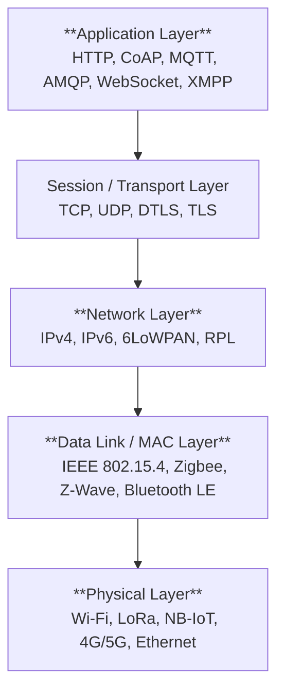

---

##### 1. Physical Layer Protocols

Responsible for actual transmission of bits over a physical medium.

|Protocol|Range|Power|Use Case|
|---|---|---|---|
|Wi-Fi (IEEE 802.11)|~100m|High|Smart home, indoor IoT|
|LoRa / LoRaWAN|~10km|Very Low|Smart agriculture, asset tracking|
|NB-IoT|Wide area|Very Low|Smart metering, city IoT|
|Bluetooth / BLE|~10m|Low|Wearables, healthcare|
|Zigbee|~75m|Low|Home automation mesh networks|
|Z-Wave|~30m|Low|Smart home devices|
|4G / 5G|Wide area|Moderate|Connected vehicles, mobile IoT|

---

##### 2. Network Layer Protocols

Handle addressing and routing of data packets.

|Protocol|Description|
|---|---|
|IPv4|Traditional 32-bit addressing, limited IoT scalability|
|IPv6|128-bit addressing - sufficient for billions of IoT devices|
|6LoWPAN|IPv6 adaptation for low-power, low-bandwidth networks (IEEE 802.15.4)|
|RPL|Routing protocol designed for low-power lossy networks|

---

##### 3. Transport Layer Protocols

Ensure reliable or fast delivery of data between source and destination.

|Protocol|Type|Use in IoT|
|---|---|---|
|TCP|Reliable, connection-oriented|Used where data integrity matters (HTTP/MQTT over TCP)|
|UDP|Unreliable, connectionless|Used for speed-critical IoT apps (CoAP runs over UDP)|
|TLS|Security layer over TCP|Encrypts MQTT, HTTP communication|
|DTLS|Security layer over UDP|Encrypts CoAP communication|

---

##### 4. Application Layer Protocols

Define the format and rules for data exchange between IoT devices and applications.

**MQTT (Message Queuing Telemetry Transport)**

- Publish-subscribe model via a broker.
- Lightweight, designed for constrained devices.
- Runs over TCP, port 1883 (8883 for TLS).
- QoS levels: 0 (at most once), 1 (at least once), 2 (exactly once).
- Use case: Remote sensor monitoring, smart home.

**CoAP (Constrained Application Protocol)**

- RESTful protocol designed for constrained devices.
- Runs over UDP - very lightweight.
- Supports GET, POST, PUT, DELETE like HTTP.
- Use case: Smart energy meters, embedded sensors.

**HTTP / HTTPS**

- Standard web protocol.
- Used when devices have enough resources.
- Heavier than MQTT/CoAP.
- Use case: Cloud APIs, REST-based IoT dashboards.

**AMQP (Advanced Message Queuing Protocol)**

- Enterprise-grade message queuing.
- Reliable delivery with acknowledgments.
- Use case: Industrial IoT, enterprise messaging.

**WebSocket**

- Full duplex communication over a single TCP connection.
- Enables real-time bi-directional communication.
- Use case: Real-time dashboards, live sensor feeds.

**XMPP (Extensible Messaging and Presence Protocol)**

- XML-based messaging protocol.
- Good for device-to-device communication.
- Use case: Smart grid, presence detection.

---

##### Protocol Comparison Table

|Protocol|Transport|Model|Weight|Best For|
|---|---|---|---|---|
|MQTT|TCP|Pub-Sub|Light|Remote monitoring|
|CoAP|UDP|Request-Response|Very Light|Constrained devices|
|HTTP|TCP|Request-Response|Heavy|Cloud APIs|
|AMQP|TCP|Message Queue|Moderate|Enterprise IoT|
|WebSocket|TCP|Bidirectional|Moderate|Real-time dashboards|
|XMPP|TCP|Pub-Sub|Moderate|Device chat / presence|

---

##### Protocol Selection by Application

|Application|Recommended Protocol|Reason|
|---|---|---|
|Smart agriculture sensor|MQTT + LoRa|Low power, long range|
|Industrial monitoring|AMQP|Reliable delivery|
|Wearable health device|BLE + MQTT|Low energy, lightweight|
|Smart meter|CoAP + NB-IoT|Very constrained, wide area|
|Real-time dashboard|WebSocket|Bidirectional live data|

---

#### 4. IoT Design Methodology

IoT Design Methodology is a systematic approach to developing IoT systems from requirement analysis to deployment. It ensures reliable, scalable, and secure systems.

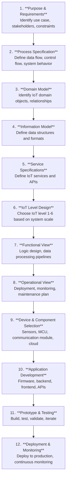

##### Step-by-Step Description

**Step 1 - Purpose & Requirements**

- Define the problem the IoT system solves.
- Identify users, environment, power constraints, and connectivity.
- Example: "Monitor patient vitals remotely in a hospital."

**Step 2 - Process Specification**

- Model system behavior using flowcharts or state machines.
- Define what happens when sensor data crosses a threshold.

**Step 3 - Domain Model**

- Identify entities: devices, users, data, gateways.
- Define relationships between them.

**Step 4 - Information Model**

- Define data schemas: JSON, XML structure of sensor data.
- Example: `{ "device_id": "001", "temp": 37.2, "timestamp": "..." }`

**Step 5 - Service Specifications**

- Define REST APIs or MQTT topics the system exposes.
- Specify authentication, authorization, and data formats.

**Step 6 - IoT Level Design**

- Choose the appropriate IoT level (1-6) based on scale and requirements.

**Step 7 - Functional View**

- Design the logic: data collection, processing, alerting, storage.

**Step 8 - Operational View**

- Plan deployment, monitoring dashboards, update mechanisms.

**Step 9 - Device & Component Selection**

- Select sensors, microcontrollers, communication modules, cloud platform.

**Step 10 - Application Development**

- Write firmware for devices.
- Develop backend APIs and frontend dashboards.

**Step 11 - Prototype & Testing**

- Build a prototype, test each component.
- Validate end-to-end data flow and response time.

**Step 12 - Deployment & Monitoring**

- Deploy to production environment.
- Set up monitoring, alerts, and over-the-air update mechanisms.

---

#### 5. Different Interfaces available in Arduino UNO

Arduino UNO provides multiple communication and I/O interfaces to connect with sensors, modules, and other devices.

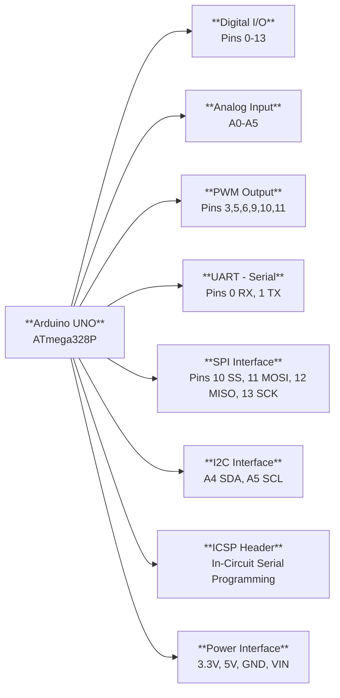

##### 1. Digital I/O Interface (Pins 0-13)

- 14 digital pins, each configurable as INPUT or OUTPUT.
- Operates at 5V logic levels.
- Maximum current per pin: 40mA.
- Used to read digital sensors (buttons, switches) or drive digital outputs (LEDs, relays).

```ino
pinMode(7, OUTPUT);
digitalWrite(7, HIGH);
```

##### 2. Analog Input Interface (Pins A0-A5)

- 6 analog input pins with 10-bit ADC resolution (0-1023).
- Input voltage range: 0V to 5V.
- Used for reading analog sensors: potentiometers, LDR, temperature sensors.

```ino
int val = analogRead(A0); // Returns 0 to 1023
```

##### 3. PWM Interface (Pins 3, 5, 6, 9, 10, 11)

- 6 pins support Pulse Width Modulation (8-bit, 0-255).
- Used for dimming LEDs, controlling servo/DC motor speed.

```ino
analogWrite(9, 128); // 50% duty cycle
```

##### 4. UART (Serial) Interface (Pins 0, 1)

- Pin 0 = RX (Receive), Pin 1 = TX (Transmit).
- Used for serial communication with PC (via USB) or other UART devices.
- Also used for GSM modules, GPS modules.

```ino
Serial.begin(9600);
Serial.println("Hello");
```

##### 5. SPI Interface (Pins 10, 11, 12, 13)

|Pin|Function|
|---|---|
|10|SS (Slave Select)|
|11|MOSI (Master Out Slave In)|
|12|MISO (Master In Slave Out)|
|13|SCK (Clock)|

- High-speed synchronous interface.
- Used with SD cards, TFT displays, RF modules (nRF24L01).

##### 6. I2C Interface (Pins A4, A5)

|Pin|Function|
|---|---|
|A4|SDA (Serial Data)|
|A5|SCL (Serial Clock)|

- 2-wire protocol supporting multiple devices with unique addresses.
- Used with OLED displays, BMP180, MPU6050.

##### 7. ICSP Header

- 6-pin header for In-Circuit Serial Programming.
- Used to flash bootloader directly using an external programmer.

##### 8. Power Interface

|Pin|Voltage|
|---|---|
|3.3V|3.3V output (up to 150mA)|
|5V|5V output (regulated)|
|GND|Ground reference|
|VIN|External power input (7-12V)|

---

#### 6. Physical design of Arduino UNO

The physical design of Arduino UNO refers to the actual hardware components and their physical layout on the board.

> **Note:** For a detailed annotated board image, refer to: [Arduino UNO Official Hardware Overview](https://store.arduino.cc/products/arduino-uno-rev3)

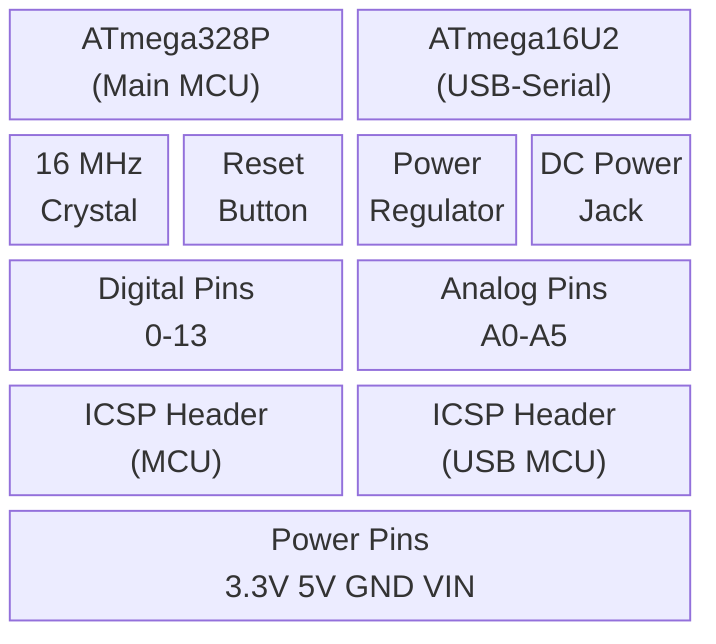

##### Key Physical Components

**1. ATmega328P Microcontroller**

- 8-bit AVR RISC microcontroller, 16 MHz clock.
- 32 KB Flash, 2 KB SRAM, 1 KB EEPROM.
- Located at the center of the board.

**2. ATmega16U2 (USB-to-Serial Converter)**

- Converts USB communication to UART for programming.
- Located near the USB-B connector.

**3. USB Type-B Connector**

- Used for programming the board and serial communication with PC.

**4. DC Power Jack**

- Accepts 7-12V DC external power supply.

**5. Voltage Regulator**

- Converts input voltage (VIN/DC Jack) to regulated 5V.

**6. Crystal Oscillator (16 MHz)**

- Provides clock signal to the MCU.

**7. Digital I/O Pin Headers (0-13)**

- 14 pins along the top edge of the board.

**8. Analog Input Pin Headers (A0-A5)**

- 6 pins along the bottom edge of the board.

**9. Power Pin Headers**

- 3.3V, 5V, GND, IOREF, RESET, VIN.

**10. ICSP Headers**

- Two 6-pin ICSP headers: one for ATmega328P, one for ATmega16U2.
- Used for bootloader burning and firmware flashing.

**11. Reset Button**

- Restarts the currently running sketch.

**12. TX/RX LEDs**

- Blink during serial data transmission/reception.

**13. Power and Pin 13 LEDs**

- Power LED: indicates board is powered.
- Pin 13 LED: built-in LED for testing.

|Specification|Value|
|---|---|
|Microcontroller|ATmega328P|
|Operating Voltage|5V|
|Input Voltage|7-12V|
|Digital I/O Pins|14 (6 PWM)|
|Analog Input Pins|6|
|Flash Memory|32 KB|
|SRAM|2 KB|
|EEPROM|1 KB|
|Clock Speed|16 MHz|

---

#### 7. Concept of sensors and actuators with types and applications in IoT systems

##### Sensors

A **sensor** is a device that detects physical or environmental parameters and converts them into electrical signals that can be read by a microcontroller or computer.

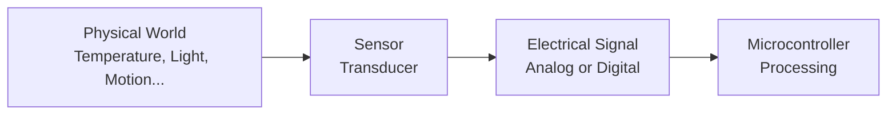

**Types of Sensors:**

|Type|Sensor|Measured Parameter|Example Application|
|---|---|---|---|
|Temperature|DHT11, LM35, DS18B20|Temperature / Humidity|HVAC, Weather station|
|Light|LDR, BH1750|Light intensity|Smart lighting, Solar tracking|
|Motion / Proximity|PIR, HC-SR04|Movement, Distance|Security systems, Smart parking|
|Pressure|BMP180, BMP280|Atmospheric pressure, altitude|Drones, Weather monitoring|
|Gas|MQ-2, MQ-135|Smoke, CO2, LPG|Gas leakage detection|
|Accelerometer / Gyro|MPU6050|Acceleration, orientation|Wearables, drones|
|Moisture|Soil moisture sensor|Water content|Smart irrigation|
|Heart Rate / SpO2|MAX30100, MAX30102|Pulse, blood oxygen|Patient monitoring|
|Sound|Sound sensor, Microphone|Audio levels|Smart home voice control|
|Current / Voltage|INA219, ACS712|Electrical parameters|Smart energy monitoring|

**Characteristics of Sensors:**

- **Sensitivity** - minimum change it can detect.
- **Accuracy** - closeness to true value.
- **Range** - minimum to maximum measurable value.
- **Response Time** - time to react to change.
- **Resolution** - smallest distinguishable increment.

---

##### Actuators

An **actuator** is a device that receives electrical control signals and converts them into physical action or mechanical movement.

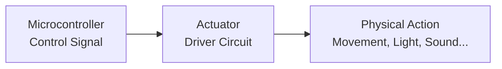

**Types of Actuators:**

|Type|Example|Output Action|Application|
|---|---|---|---|
|Electric Motor|DC Motor, Servo, Stepper|Rotational motion|Robots, conveyor belts, drones|
|Relay|Electromagnetic relay|On/Off switching|Smart switches, industrial control|
|LED / Display|RGB LED, LCD, OLED|Visual output|Indicators, dashboards|
|Solenoid Valve|Solenoid valve|Fluid/gas flow control|Smart irrigation, HVAC|
|Buzzer / Speaker|Piezo buzzer|Audio alert|Alarms, notifications|
|Heater / Cooler|Peltier module|Temperature control|Incubators, cooling systems|
|Linear Actuator|Pneumatic actuator|Linear motion|Automated doors, robotic arms|

---

##### Sensor-Actuator Interaction in IoT

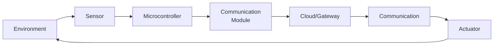

The sensor continuously feeds data to the microcontroller, which processes it and decides whether to trigger an actuator - locally or via cloud commands.

**Example:** In a smart greenhouse:

- Soil moisture sensor detects low moisture.
- MCU sends data via Wi-Fi to cloud.
- Cloud logic triggers a command.
- Solenoid valve (actuator) opens to irrigate.

---

#### 8. IoT Physical Design

The **physical design of an IoT system** describes the actual hardware components and their interconnection that form the complete IoT deployment.

##### Components of IoT Physical Design

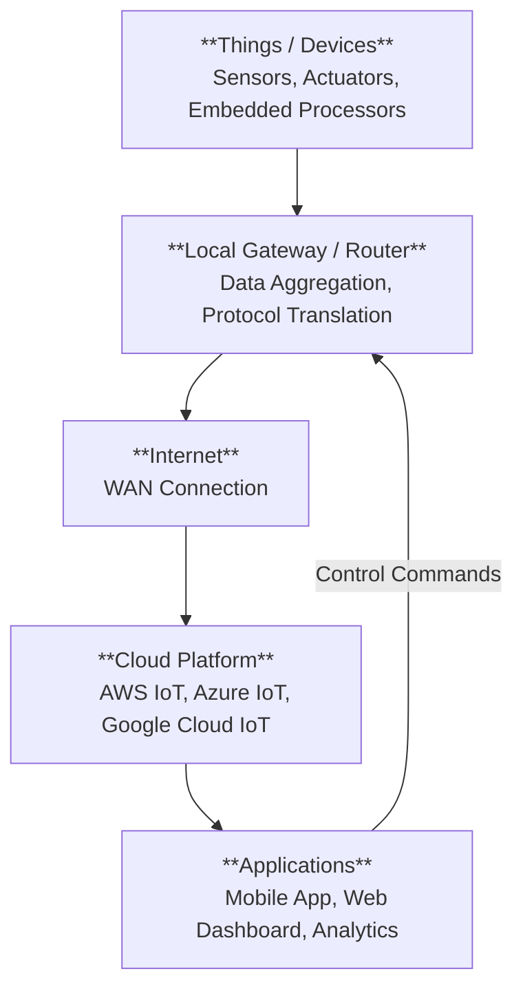

##### 1. Things (End Devices)

- Physical objects embedded with sensors and actuators.
- Include embedded processor/microcontroller (Arduino, ESP32, Raspberry Pi).
- Communicate wirelessly (Wi-Fi, Zigbee, BLE) or wired (Ethernet, RS485).

##### 2. Gateway

- Bridges the communication between end devices and the internet.
- Performs protocol translation (e.g., Zigbee to MQTT over TCP/IP).
- May perform edge processing and data filtering.
- Examples: Raspberry Pi gateway, commercial IoT hubs.

##### 3. Communication Network

- Connects devices to the gateway and gateway to cloud.
- Technologies: Wi-Fi, LoRa, NB-IoT, 4G/5G, Ethernet.
- Protocols: MQTT, CoAP, HTTP.

##### 4. Cloud Platform

- Stores and processes large volumes of IoT data.
- Provides APIs for device management, data analytics, and dashboards.
- Examples: AWS IoT Core, Azure IoT Hub, ThingSpeak, Google Cloud IoT.

##### 5. Application Layer

- End-user interface: mobile app, web dashboard.
- Enables monitoring, control, alerts, and data visualization.

##### Physical Design Elements Summary

|Element|Hardware Example|Role|
|---|---|---|
|Sensor node|Arduino + DHT11 + ESP8266|Data collection|
|Actuator node|Arduino + Relay module|Physical action|
|Local gateway|Raspberry Pi|Aggregation + routing|
|Communication|Wi-Fi Router|Network access|
|Cloud|AWS IoT Core|Data storage + processing|
|Application|React Web App|User interface|

---

#### 9. Functional parts of IoT with neat diagram

The **functional architecture of IoT** describes the logical components and how they interact to achieve a complete IoT solution.

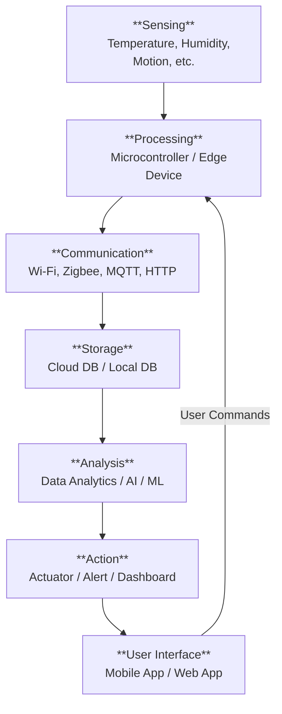

##### 1. Sensing / Perception

- Interface with the physical world through sensors.
- Converts physical parameters (temp, light, motion) to digital data.
- Also includes actuators for output actions.
- **Components:** Sensors (DHT11, PIR), ADC, signal conditioning circuits.

##### 2. Processing

- Core computation unit of the IoT device.
- Reads sensor data, applies logic, decides actions.
- Can perform edge computing to reduce cloud dependency.
- **Components:** Microcontrollers (Arduino, STM32), Single Board Computers (Raspberry Pi, ESP32).

##### 3. Communication

- Transfers processed data to cloud/gateway and receives commands.
- Involves multiple protocols depending on range and power.
- **Components:** Wi-Fi module (ESP8266), LoRa module, Zigbee, Cellular (SIM800).
- **Protocols:** MQTT, CoAP, HTTP, Zigbee.

##### 4. Storage

- Stores sensor data for historical analysis and auditing.
- Local storage: SD card, EEPROM, local database.
- Cloud storage: AWS S3, Firebase, InfluxDB (time-series).

##### 5. Analysis

- Derives insights from collected data.
- Real-time analysis: anomaly detection, threshold alerts.
- Batch analysis: trend analysis, predictive maintenance using ML.
- **Tools:** Node-RED, AWS Lambda, Google Dataflow, Python ML models.

##### 6. Action / Control

- Based on analysis, system triggers actuators or sends notifications.
- Example: Alert SMS sent, relay switched ON, valve opened.

##### 7. User Interface

- Allows users to monitor system status and issue control commands.
- Dashboards: Grafana, ThingSpeak, custom React/Angular apps.
- Mobile apps for remote monitoring.

##### Functional Parts Summary Table

|Functional Part|Hardware|Software/Protocol|
|---|---|---|
|Sensing|Sensors, ADC|Device driver, firmware|
|Processing|MCU, SBC|Arduino IDE, Python|
|Communication|Wi-Fi, LoRa, Zigbee|MQTT, CoAP, HTTP|
|Storage|SD card, Cloud DB|Firebase, InfluxDB|
|Analysis|Cloud server, Edge|Python, Node-RED, ML|
|Action|Actuators, Buzzers|Control logic|
|User Interface|PC, Mobile|Web app, Mobile app|

---

#### 10. IoT based patient monitoring system by selecting sensors and actuators (16 marks)

##### Overview

An IoT-based patient monitoring system continuously tracks vital parameters of a patient and sends real-time data to healthcare providers via the internet, triggering alerts when values deviate from normal.

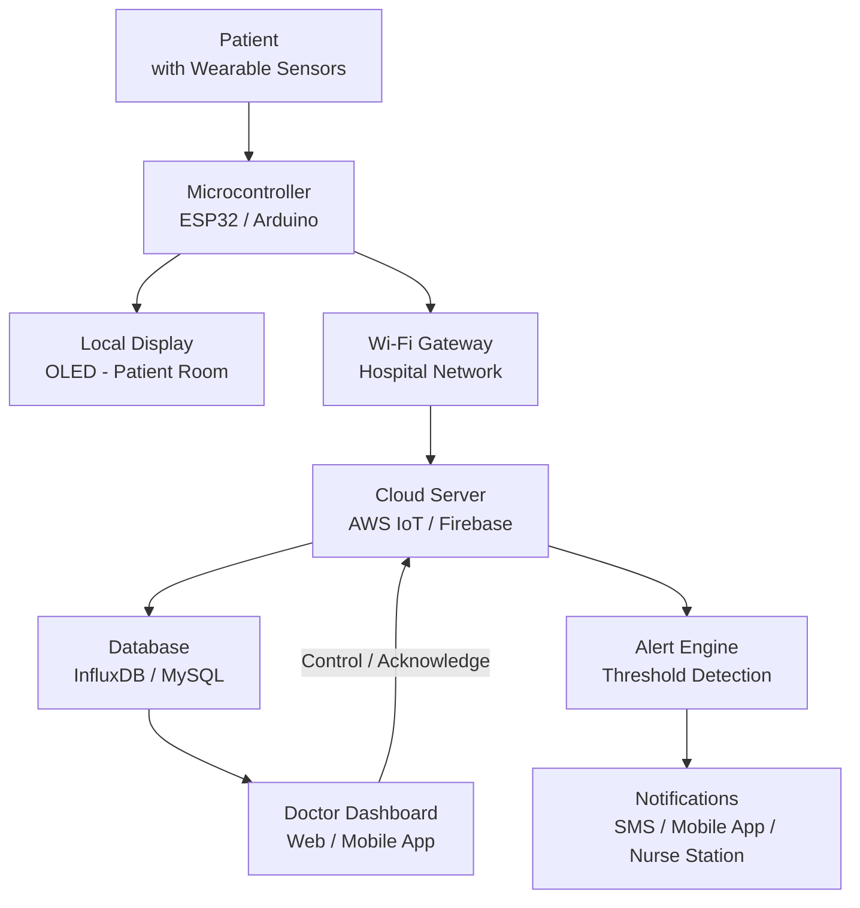

---

##### Sensors Selected

|Parameter|Sensor|Normal Range|Interface|
|---|---|---|---|
|Heart Rate & SpO2|MAX30102|HR: 60-100 bpm, SpO2: >95%|I2C|
|Body Temperature|MLX90614 (IR)|36.5 - 37.5°C|I2C|
|Blood Pressure|BMP280 (indirect)|90/60 - 120/80 mmHg|I2C|
|ECG|AD8232 ECG module|Normal sinus rhythm|Analog|
|Respiratory Rate|MPU6050 (chest movement)|12-20 breaths/min|I2C|
|Ambient Temperature|DHT22|Environment monitoring|Digital|
|Patient Motion / Fall|ADXL345 Accelerometer|Detect falls|I2C|

---

##### Actuators / Output Devices Selected

|Output|Component|Purpose|
|---|---|---|
|Local alarm|Piezo buzzer|Alert if critical value detected locally|
|Visual indicator|RGB LED|Green = normal, Red = critical|
|Display|0.96" OLED|Show vitals on patient bedside monitor|
|Relay|Relay module|Control IV drip rate or medical equipment|

---

##### Hardware Architecture

**Central Controller:** ESP32 (dual-core, built-in Wi-Fi + Bluetooth)

- Reads all sensors over I2C and analog pins.
- Processes data locally (edge detection of abnormal vitals).
- Publishes data to MQTT broker over Wi-Fi.

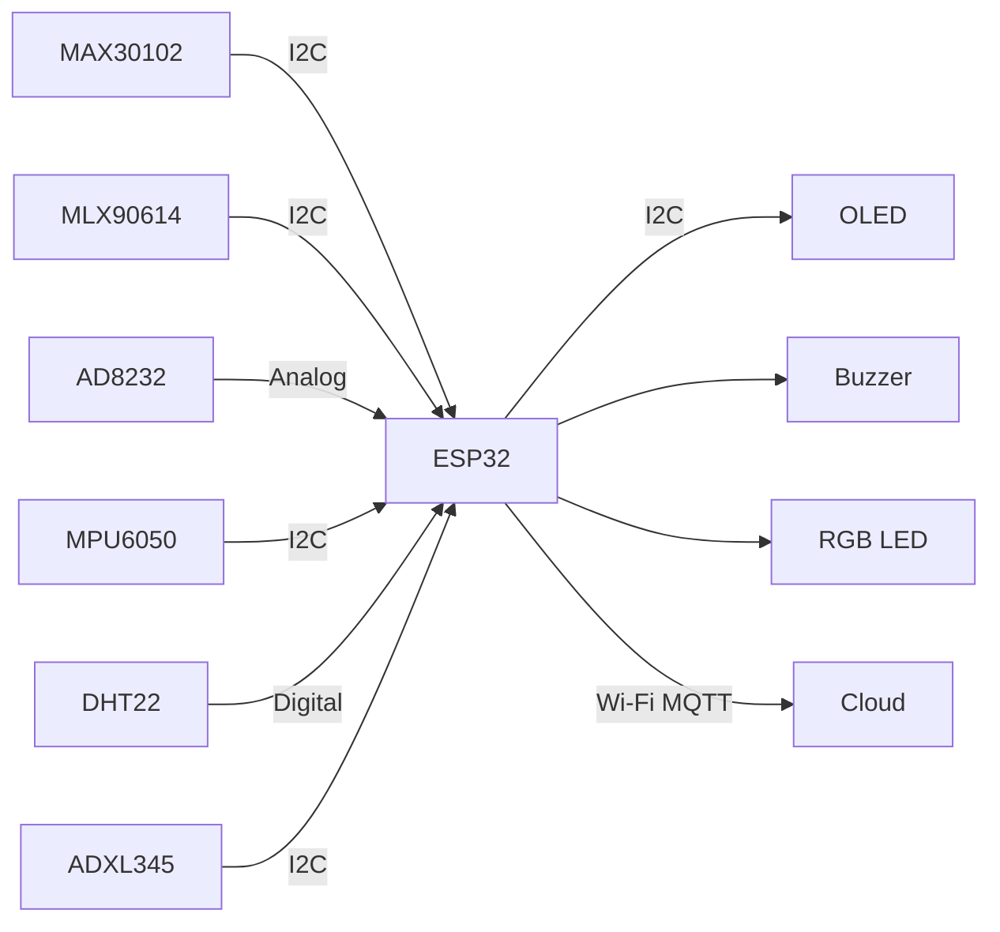

---

##### Data Flow

1. Sensors continuously sample patient vitals every few seconds.
2. ESP32 reads data, applies threshold checks (edge processing).
3. If any value is abnormal - local buzzer/LED alerts instantly.
4. ESP32 publishes all readings via MQTT to cloud broker (e.g., AWS IoT Core).
5. Cloud stores data in time-series database (InfluxDB).
6. Alert engine checks thresholds; if exceeded - triggers SMS/push notification to doctor.
7. Doctor views real-time and historical dashboard on web/mobile app.

---

##### Alert Thresholds

|Vital|Warning Threshold|Critical Threshold|
|---|---|---|
|Heart Rate|<50 or >120 bpm|<40 or >150 bpm|
|SpO2|<94%|<90%|
|Temperature|>38°C|>39.5°C|
|Respiratory Rate|<10 or >25 breaths/min|<8 or >30 breaths/min|

---

##### Communication Stack

|Layer|Technology|
|---|---|
|Sensor to MCU|I2C, Analog|
|MCU to Cloud|Wi-Fi + MQTT (TLS)|
|Cloud to Doctor|HTTPS + WebSocket|
|Alert Delivery|SMS (Twilio), Push Notification|

---

##### System Features

- **Real-time monitoring** with < 2 second latency.
- **Local edge alerts** even if internet is down.
- **Historical data** for trend analysis and discharge reports.
- **Multi-patient support** via unique device IDs per patient.
- **Secure data** transmission via TLS-encrypted MQTT.

---

##### Advantages

|Feature|Benefit|
|---|---|
|Continuous monitoring|Eliminates need for manual hourly checks|
|Remote access|Doctor monitors from anywhere|
|Automated alerts|Faster emergency response|
|Data logging|Supports clinical decision making|
|Scalable|Deploy across multiple wards easily|

---

#### 11. Program to toggle LED when a button is pressed

**Logic:** The LED state flips each time the button is pressed (not held). Debouncing is implemented to avoid false triggers.

```ino
const int ledPin = 13;
const int buttonPin = 2;

bool ledState = false;
bool lastButtonState = LOW;
bool currentButtonState = LOW;
unsigned long lastDebounceTime = 0;
const unsigned long debounceDelay = 50; // ms

void setup() {
  pinMode(ledPin, OUTPUT);
  pinMode(buttonPin, INPUT);
  digitalWrite(ledPin, LOW);
}

void loop() {
  bool reading = digitalRead(buttonPin);

  // Reset debounce timer if button state changed
  if (reading != lastButtonState) {
    lastDebounceTime = millis();
  }

  // Only register input after debounce period
  if ((millis() - lastDebounceTime) > debounceDelay) {
    if (reading != currentButtonState) {
      currentButtonState = reading;

      // Toggle LED only on button press (rising edge)
      if (currentButtonState == HIGH) {
        ledState = !ledState;
        digitalWrite(ledPin, ledState ? HIGH : LOW);
      }
    }
  }

  lastButtonState = reading;
}
```

**Explanation:**

- `ledState` tracks whether the LED is currently ON or OFF.
- The button press is detected on the **rising edge** (LOW to HIGH transition) to avoid toggling multiple times per press.
- Debounce logic filters out electrical noise from the button contacts using a 50ms delay window.
- `millis()` is used (not `delay()`) so the system remains responsive.